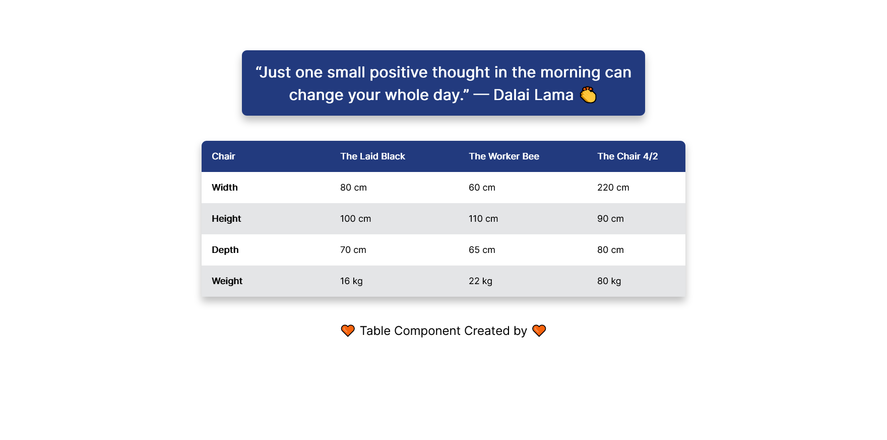

# Table Component

The [Table Component](https://farhdibehnamdev.github.io/Table-Component/) is designed to practice and explore basic HTML , CSS.

The template is a guide meant for you to explore and change to ✨*make it your own*✨

## Table of contents

- [Overview](#overview)
  - [So how do I use this?](#So-how-do-I-use-this)
  - [The challenge](#the-challenge)
  - [Screenshot](#screenshot)
  - [Links](#links)
- [My process](#my-process)
  - [Built with](#built-with)
  - [helpful resources](#helpful-resources)
- [Created a masterpiece? 🎨 Share it!](#Created-a-masterpiece)

## So how do I use this?

1. Download the files ⬇️
2. Open in a text editor of your choice and change the place holder content to your hearts content 💛
3. Of course, I have used Visual Studio Code.

### The challenge

Users should be able to:

- You can see table with diffrent row colors.

### Screenshot

### Links

- Live Site URL: [Table Component](https://farhdibehnamdev.github.io/Table-Component/)

## My process

### Built with

- Semantic HTML5 markup
- Grid

## helpful resources

#### Fonts

- [Google Fonts](https://fonts.googleapis.com/css2?family=Inter)

#### Colors

- [Open Color](https://yeun.github.io/open-color/)

#### CSS

- [Mozilla Developer Network: Beginners Guide to CSS](https://developer.mozilla.org/en-US/docs/Learn/CSS/Introduction_to_CSS)

## Created a masterpiece? 🎨 Share it!

If so, please fork this repo and add a link to this README.md or create an issue with the github page link and to have it added to the README.md.
